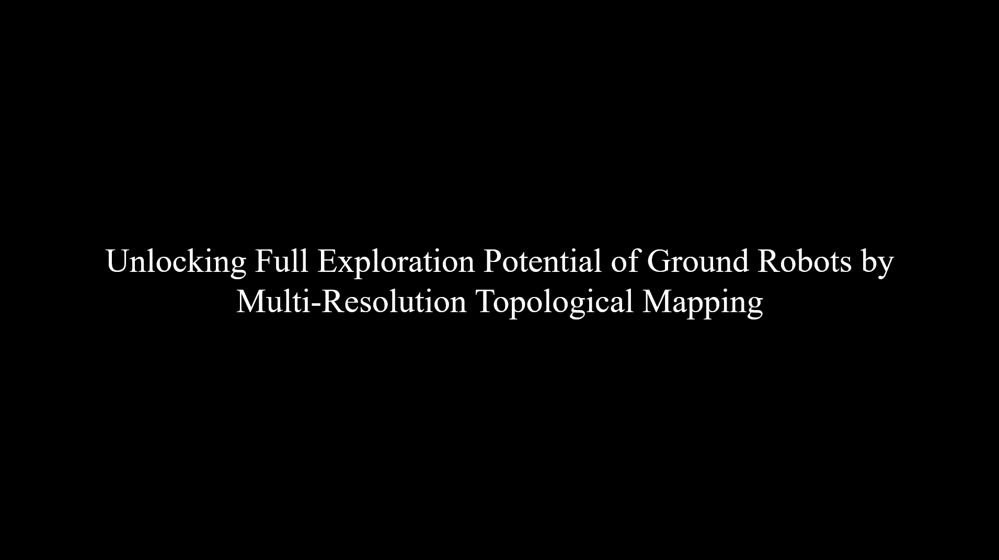

# UFEP_Released
Unlocking Full Exploration Potential of Ground Robots by Multi-Resolution Topological Mapping.

All the source code are here. However, due to recent events, the detailed usage steps have not been updated yet. Users can gradually configure based on reminders of compiler. We will provide detailed usage instructions in a few days.

## Dependencies
These instructions assume that ROS desktop-full of the appropriate ROS distro is installed.

Install necessary libraries:

- [pplanner_simulator](https://github.com/YinghaoJia98/pplanner_simulator.git). The simulator of robots. We will provide a custom branch for UFEP in a few days.

- [grid_map](https://github.com/ANYbotics/grid_map) (grid map library for mobile robots)
```bash
sudo apt-get install ros-noetic-grid-map-core ros-noetic-grid-map-msgs
```
- [elevation_mapping_cupy](https://github.com/YinghaoJia98/elevation_mapping_cupy.git) The test_carved_stair branch is used in my experiment and the original [elevation_mapping_cupy](https://github.com/leggedrobotics/elevation_mapping_cupy.git) also can be used.
- [vrmapping_msgs](https://github.com/YinghaoJia98/vrmapping_msgs.git) The msg and srv files which would be in cluded into this pack in the future.
- [vrmapping_ui](https://github.com/YinghaoJia98/vrmapping_ui.git) The ui files which would be in cluded into this pack in the future.

## Build
```bash
mkdir -p mmapping_ws/src/
git clone git@github.com:YinghaoJia98/UFEP_Released.git
catkin build -DCMAKE_BUILD_TYPE=Release
```

## Experiments Videos
[](https://youtu.be/i0CMJkWDkV0)

## Thanks
The robots used in simulator is reorganized from [GBP](https://github.com/ntnu-arl/gbplanner_ros.git) and [UnitreeA1](https://github.com/ShuoYangRobotics/A1-QP-MPC-Controller.git).
Benifiting from the robotics community and we choose to make our work public.

## Contact us
* [Yinghao Jia](mailto:yinghaojia@163.com)
* Wei Tang